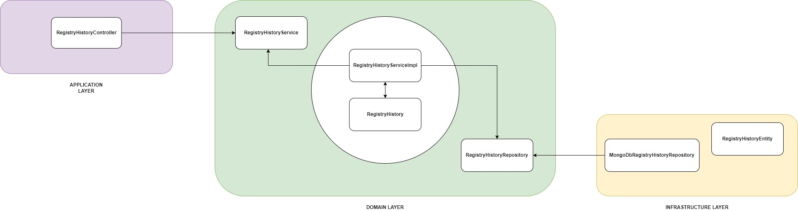

# registration-history-service

**registration-history-service** é um microsserviço responsável por registrar um histórico cadastral.

O serviço foi desenvolvido em Kotlin e com [Vert.x-Web](https://vertx.io/docs/vertx-web/java/) para escrever aplicativos da Web modernos e sofisticados e microsserviços HTTP.

Essa API foi desenvolvida com:
- [Kotlin (JDK 8)](https://kotlinlang.org/)
- [Vert.x-Web](https://vertx.io/docs/vertx-web/java/)
- [Koin](https://insert-koin.io/)
- [MongoDB](https://www.mongodb.com/)
- [Docker](https://www.docker.com/)
- [OpenAPI 3](https://swagger.io/docs/specification/about/)

### Como executar
- Verifique se você tem instalado o [docker-compose](https://docs.docker.com/compose/gettingstarted/) em seu computador.
- Execute o seguinte comando na raiz do projeto:
```
  $ docker-compose build
```
- Execute o seguinte comando na raiz do projeto:
```
  $ docker-compose up
```
- Para testar, execute o seguinte comando no terminal:
```
  $ curl --location --request GET 'http://localhost:7000/health-check'
```
### Testes de componentes em construção
- Testes unitários para regras de negócio e
- Testes de componente para o contrato e respostas http esperadas.

### Documentação
Abra o arquivo spec.yml na raiz do projeto em [OpenAPI na web](https://editor.swagger.io/).

### Decisões de projeto

O DDD (Domain Driven Design) foi utilizado para estruturar o microsserviço utilizando as 3 camadas:
 - Aplicação
 - Domínio e
 - Infraestrutura 

A camada de aplicação por receber as requisições, a domínio por armazenar a lógica de negócio e a camada de infraestrutura para persistência dos dados.

A requisição é passada para a interface do serviço do domínio, que converte a solicitação no objeto de domínio. A implementação do serviço possui todos os requisitos de negócios.
Se uma exceção for lançada, este próprio serviço a trata e retorna o resultado. A camada de aplicação é responsável por convertê-la em uma resposta mais apresentável.

A camada de domínio imprime o que está acontecendo nos logs, que podem fornecer a solução de problemas no ambiente de produção.

A camada de persistência é responsável por converter as entidades em documentos para persistir em banco de dados.
